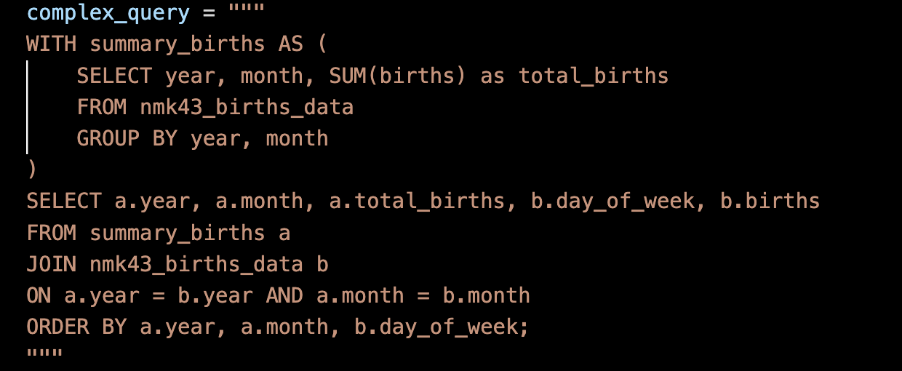

## Mini Project 6: Database Operations with Databricks


This project demonstrates how to extract, load, and query data related to US births from 2000 to 2014. We used Databricks SQL for database operations, which involves downloading a dataset, loading it into a Databricks database, and querying it for specific information.

# Project Overview

The main script performs the following operations:

**Extract**: Downloads the dataset (US Births) from an online source.

**Load** : Loads the extracted dataset into a table within the Databricks database.

**Query** : Queries the data with a complex SQL query involving aggregation and joins.

# Setup Instructions

- Clone the repository: git clone https://github.com/nogibjj/Nzarama_Kouadio_DE_Mini_Project6.git

- Install dependencies: pip install -r requirements.txt

- Update the .env file with Databricks credentials (API key, host, etc.)

- Run main.py to run the core functions: extract, load, and query the data

- To run tests: python test_lib.py

# Explanation of SQL Query

The SQL query aggregates birth data by year and month and performs a join operation on the same table (self-join) to provide detailed day-of-week information. The results are sorted by year, month, and day of the week.



- WITH clause (summary_births): This part aggregates the total number of births per year and month. It groups the data by `year` and `month` and calculates `SUM(births)` for each group, naming this aggregation `total_births`.

- Join: the query then joins the aggregated results (`summary_births`) with the original data (`nmk43_births_data`) on the `year` and `month`. This join allows detailed information about the `day_of_week` and `births` to be combined with the monthly totals.

- Ordering: final results are sorted by `year`, `month`, and `day_of_week`, so that the data is organized chronologically. For full transparacy, the original data was alreday sorted in chronological order, but this query ensures that even if future data is added in an unorganized manner, it will still return results in chronological order. 

# Important File Elements

```
mylib/                        # Python library containing main functions
  ├── extract.py              # Function to extract data from a dataset
  ├── transform_load.py       # Function to load data into Databricks
  ├── query.py                # Function to execute SQL queries
main.py                       # Main Python script for extraction, loading, and querying
test_lib.py                   # Test file for core functions
requirements.txt              # Dependencies (requests, pandas, databricks-sql-connector, etc.)
```

# Requirements

- Python 3.12.5

- Databricks SQL connector

- Requests

- Pandas

- Python-dotenv


